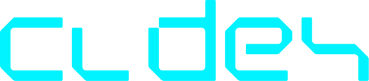

**CODEX** é uma plataforma de aprendizado de programação voltada ao ensino de programação competitiva e desenvolvimento de competências tecnológicas. A plataforma oferece um ambiente completo para treinar, competir e evoluir suas habilidades de codificação.

## 🌟 Sobre o Projeto

O CODEX é uma plataforma educacional que combina o melhor da programação competitiva com recursos modernos de gamificação e avaliação inteligente. Nosso objetivo é tornar o aprendizado de programação mais acessível, engajante e efetivo para estudantes e entusiastas da área de tecnologia.

## ✨ Funcionalidades Atuais

### Landing Page
- ✅ Design moderno com tema escuro e efeitos glassmorphism
- ✅ Interface responsiva para desktop e mobile
- ✅ Animações suaves com Framer Motion
- ✅ Suporte a múltiplos idiomas (Português e Inglês)
- ✅ Componentes reutilizáveis e otimizados

### Internacionalização (i18n)
- ✅ Sistema completo de tradução (PT/EN)
- ✅ Seletor de idioma integrado no navbar
- ✅ Traduções organizadas por seção

## 🚀 Funcionalidades Planejadas

### 📚 Banco de Questões
- Repositório extenso com questões de competições locais e internacionais
- Organização por níveis de dificuldade e competências
- Integração com competições como ICPC, IOI, Codeforces, entre outras

### 🎯 Sistema de Avaliação
O CODEX contará com dois modos de avaliação:

#### Avaliação Dinâmica
- Análise do código como um todo
- Feedback sobre o quão próximo a solução está da resposta correta
- Sugestões de melhoria e otimização

#### Avaliação Rígida
- Avaliação tradicional baseada em casos de teste
- Verificação binária: aprovado ou reprovado
- Métricas de performance (tempo e memória)

### 🏆 Modos de Competição

O CODEX oferecerá diversos modos de jogo para tornar o aprendizado mais dinâmico:

- **1v1**: Duelos diretos entre dois competidores
- **Descubra a Competência**: Identifique o conceito/algoritmo necessário
- **Duplas/Trios/Quartetos**: Competições em equipe
- **Competição de Velocidade**: Resolva o máximo de questões no menor tempo
- **Organize o Passo-a-Passo**: 
  - Passos gerados por IA
  - Organize corretamente a lógica do algoritmo
- **Corrija o Código**: Identifique e corrija bugs em códigos existentes

### 📰 Newsletter Integrada
- Notícias sobre competições
- Datas importantes de torneios
- Dicas e tutoriais úteis
- Atualizações da plataforma

### 🎮 Sistema de Torneios
- Salas fechadas para competições privadas
- Salas abertas ao público
- Filtros por nível de dificuldade
- Filtros por competência/tópico
- Rankings regionais e globais

## 🛠️ Tecnologias Utilizadas

### Frontend
- **React** - Framework JavaScript
- **TypeScript** - Tipagem estática
- **Vite** - Build tool e dev server
- **Tailwind CSS v4** - Framework CSS utilitário
- **Framer Motion** - Animações
- **i18next** - Internacionalização
- **Lucide React** - Biblioteca de ícones

### Ferramentas de Desenvolvimento
- **ESLint** - Linting
- **PostCSS** - Processamento CSS
- **Autoprefixer** - Compatibilidade CSS

## 📦 Instalação e Execução

### Pré-requisitos
- [Bun](https://bun.sh/) (versão 1.0 ou superior)

### Passos para execução

1. Clone o repositório:
```bash
git clone https://github.com/seu-usuario/codex.git
cd codex
```

2. Instale as dependências:
```bash
bun install
```

3. Execute em modo de desenvolvimento:
```bash
bun run dev
```

4. Acesse a aplicação:
```
http://localhost:5173
```

### Scripts Disponíveis

- `bun run dev` - Inicia o servidor de desenvolvimento
- `bun run build` - Gera build de produção
- `bun run preview` - Visualiza o build de produção localmente
- `bun run lint` - Executa o linter

## 📁 Estrutura do Projeto

```
codex/
├── src/
│   ├── assets/          # Imagens e recursos estáticos
│   ├── components/      # Componentes React
│   │   ├── Navbar.tsx
│   │   ├── Hero.tsx
│   │   ├── Features.tsx
│   │   ├── Showcase.tsx
│   │   ├── LeaderboardPreview.tsx
│   │   └── Footer.tsx
│   ├── locales/         # Arquivos de tradução
│   │   ├── en/
│   │   └── pt/
│   ├── i18n.ts          # Configuração i18n
│   ├── index.css        # Estilos globais
│   ├── App.tsx          # Componente principal
│   └── main.tsx         # Entry point
├── public/              # Arquivos públicos
├── index.html           # HTML base
├── package.json         # Dependências
├── tailwind.config.js   # Configuração Tailwind
├── tsconfig.json        # Configuração TypeScript
└── vite.config.ts       # Configuração Vite
```

## 🎨 Design System

### Cores Principais
- **Background**: `#030712` (Deep Navy)
- **Primary**: `#F77D13` (Orange)
- **Secondary**: `#a855f7` (Purple)
- **Accent**: `#06b6d4` (Cyan)

### Tipografia
- **Sans**: Inter
- **Mono**: JetBrains Mono

## 🌍 Idiomas Suportados

- 🇧🇷 Português
- 🇺🇸 English

## 📝 Licença

© 2025 CODEX Platform. Todos os direitos reservados.

## 🤝 Contribuindo

Contribuições são bem-vindas! Sinta-se à vontade para abrir issues e pull requests.

## 📧 Contato

Para mais informações, visite [codexcode.vercel.app](https://codexcode.vercel.app)

---

**Desenvolvido com ❤️ para a comunidade de programação competitiva**
